```{r setup, include=FALSE}
knitr::opts_chunk$set(echo = TRUE)
```

# Data Exploration (EDA):

This EDA will be a composite of a couple of sections, designed to answer specific questions. The source data is in the folder source_data and is from Kaggle. I chose this collection of datasets for three primary reasons. The first being its relation to the marketing industry and the second being it a collection of smaller datasets rather than one huge dataset. The third is cleanliness of the datasets themselves.

Looking at the composite data, it seems as though the data is very clean (no NAs and no glaring errors in data entries), which makes sense as the data description from kaggle did mention that it was very clean and easy to work with. Just looking at the datasets overall, I believe that this data likely originates from one of two sources. It is either human generated (artificial) or real data already pre-processed by an experienced data handler as the encodings for categorical variables like target_interests from the ads.csv dataset (source data) and the interests in the users.csv dataset (source data) columns match exactly in terms of categories. This is highly unlikely in the real world and thus leads to such guesses.


The rest of this EDA will be split into three sections, aiming to answer the following three questions:
0.1) Are there certain users who out-interact the other users (outliers in terms of number of interactions)?
0.2) Do certain interests get more interactions online? Perhaps technology for instance?
0.3) What does the distribution of age of users look like?

## 0.1

To answer this question, I wanted to first visualize a distribution of the number of interactions per user.

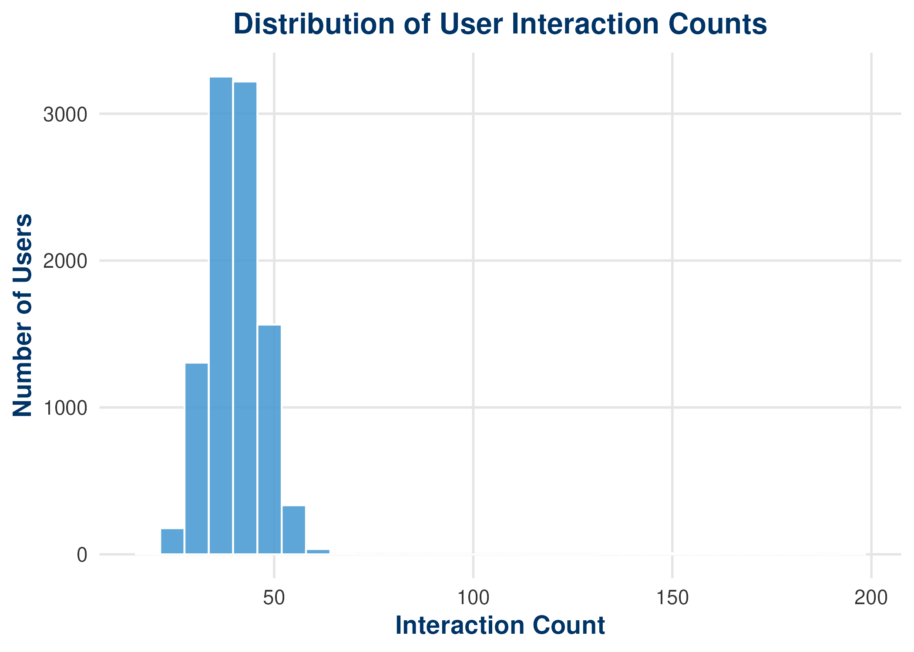


The histogram shows a huge range for the x axis, which makes me question why when all the observations seem grouped to one side. Thus, I am making a boxplot of this data to see what in the world is going on.

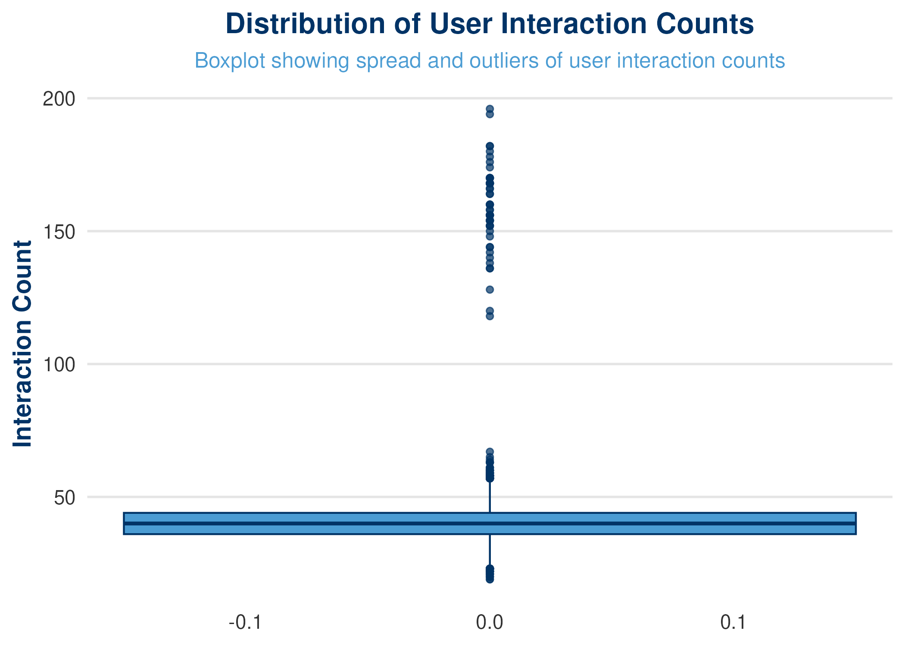

It looks like there are a handful of users who are highly interactive with these ads. It may be wise to filter into these users and look at what differentiates these users. I will look at four primary variables of potential interest: gender, age, country and interests.


### Gender

Looking at gender, I mainly want to see if there is a significant difference in terms of count between the genders. I decided to use tables to show this:


For those who underinteracted, it is pretty difficult to tell if there is an association of any sort because there are so few observations. For those who overinteracted, it was surprising that so many users who identified as male. I might be a bit biased, but generally, those who often are on social media the most are female... so this could indicate a platform difference or just a difference in overall distribution amongst the observed users.

### Age

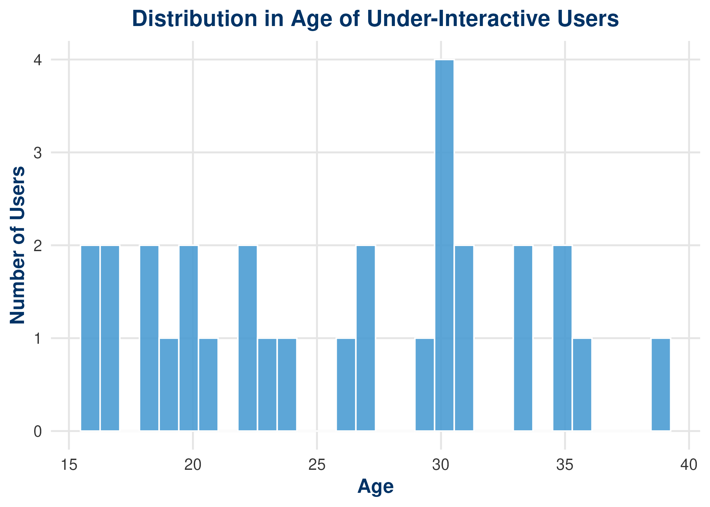
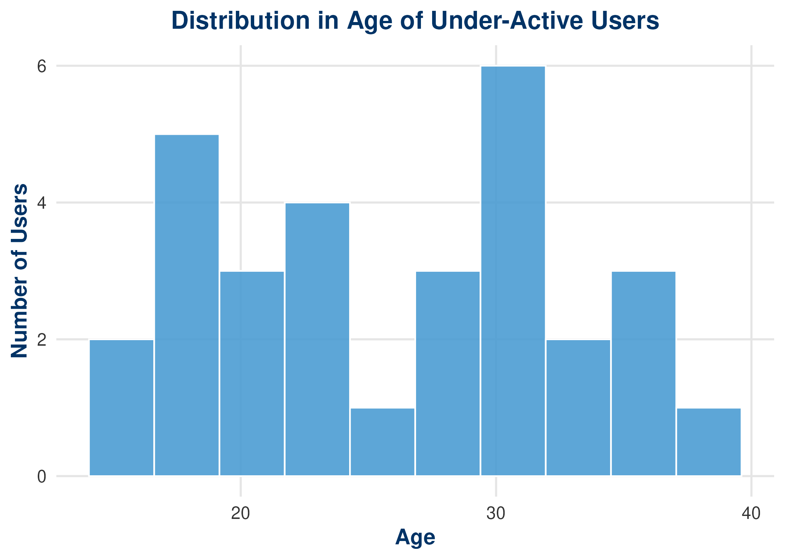

The histogram of the distribution of ages for over-interactive users displays a general trend towards the younger ages, with a right tail. This trend is generally as expected given the heavier use of technology (especially social media) amongst the younger (but not too young) population. As seen in the histogram, the largest number of over-interactive users are between 20-30 years old. The majority of this population are typically very well versed in social media platforms and have access to such platforms. People of older ages often use social media less and those of ages less than 13 might have parental restrictions thus causing this distribution. The age distribution of those who under-interact are more difficult to establish reasoning or a pattern for. This is in part due to the limited number of users who are under-interacting to the point of being 'outliers'. With so few observations, the distribution of age in users who under-interact could be purely by chance. In addition to the factors already mentioned, it is important to keep in mind the overall distribution of ages within the entire dataset. While the raw numbers of those ages 20-30 look high in comparison to the other ages, it is very possible that amongst the users observed within the entire dataset, there is an over-representation of users in that age range.

### Country

Following from the note on the distribution of the original dataset, in looking at the distribution of countries of origin for over-interactive and under-interactive users, I first computed the distribution in countries of origin of the dataset as a whole, and then looked at the proportion of users from each country who were in the over-interactive dataset and the under-interactive dataset. Below are the respective tables.


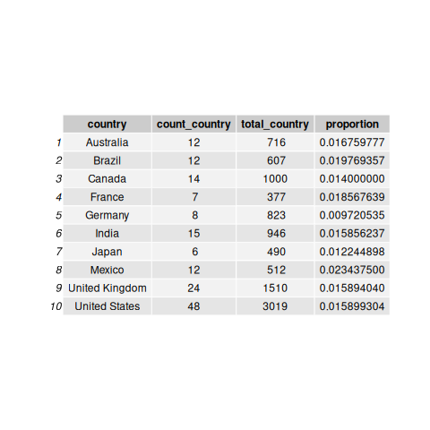

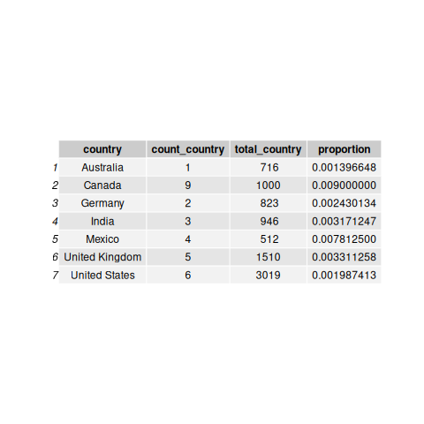


As seen here, while there is a significant raw count of people from the US who are over-interactive, the proportion of users from the US who were over-interactive is about average amongst the 10 countries. In particular, the proportion of users from Brazil and Mexico who were over-interactive were slightly higher than the others. Amongst those who were under-interactive, it would seem as though those from Canada and Mexico were slightly more than the others. This being said, the generalization of such a pattern would need further analysis.

### Interests

I wanted to see whether one particular interest was significantly dominant among users who over-interact and under-interact.

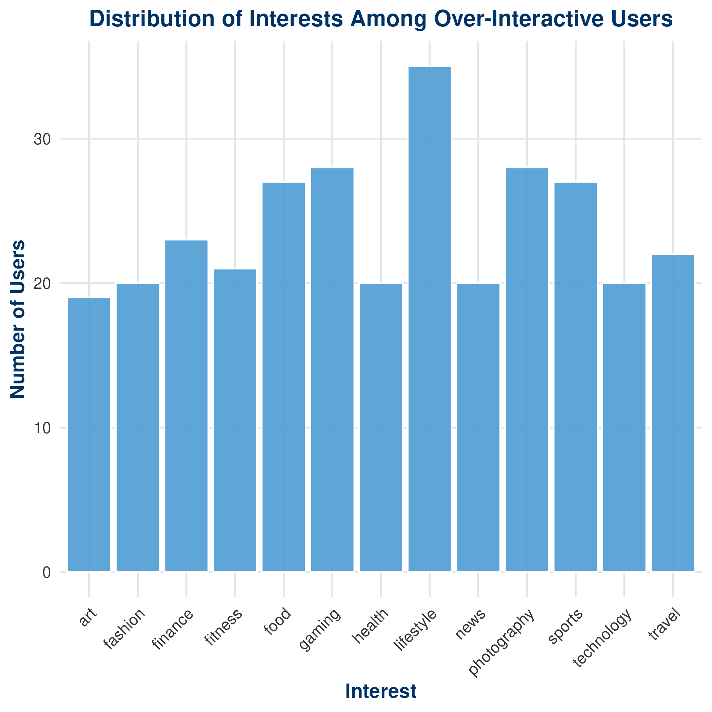
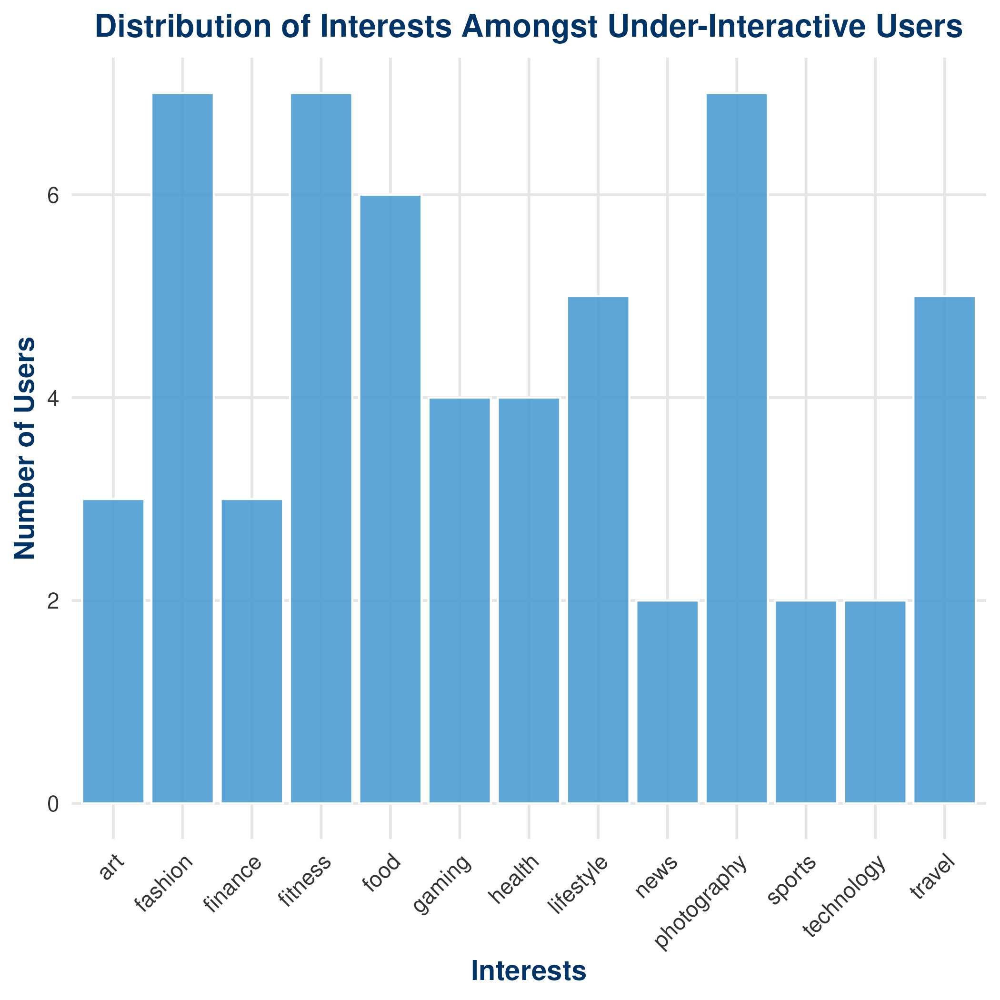

The raw numbers do not display a significant number of users with one interest or another in either over-interactive users or under-interactive users. There could be an exploration into proportion of users with these interests that are outliers, but as of right now, I believe the distributions displayed by the bar charts are sufficient for determining no one interest is overwhelmingly dominant in either over-interactive nor under-interactive users.

## 0.2
Just to get a general idea of the data that I will be working with, this next section of the EDA will just be looking at the distribution of interests among users. I am also looking for class imbalances with this category as it will affect the other sections of analysis.

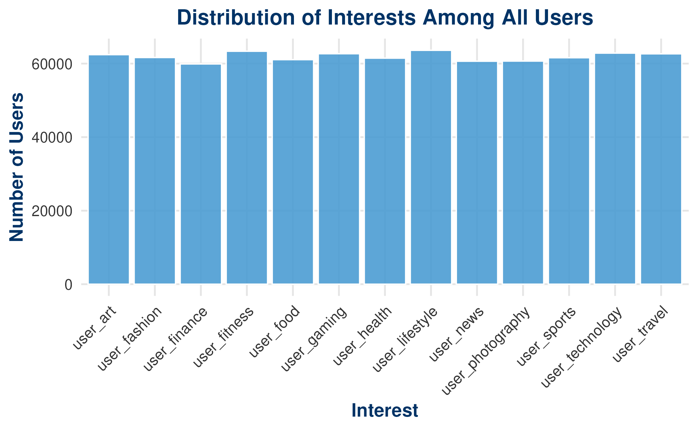

It seems as though overall, there is no single interest that is significantly dominant/ overwhelming over the others.

## 0.3
In the same way, I wanted to look at age distributions in case I decide to do something more interesting with this variable later.

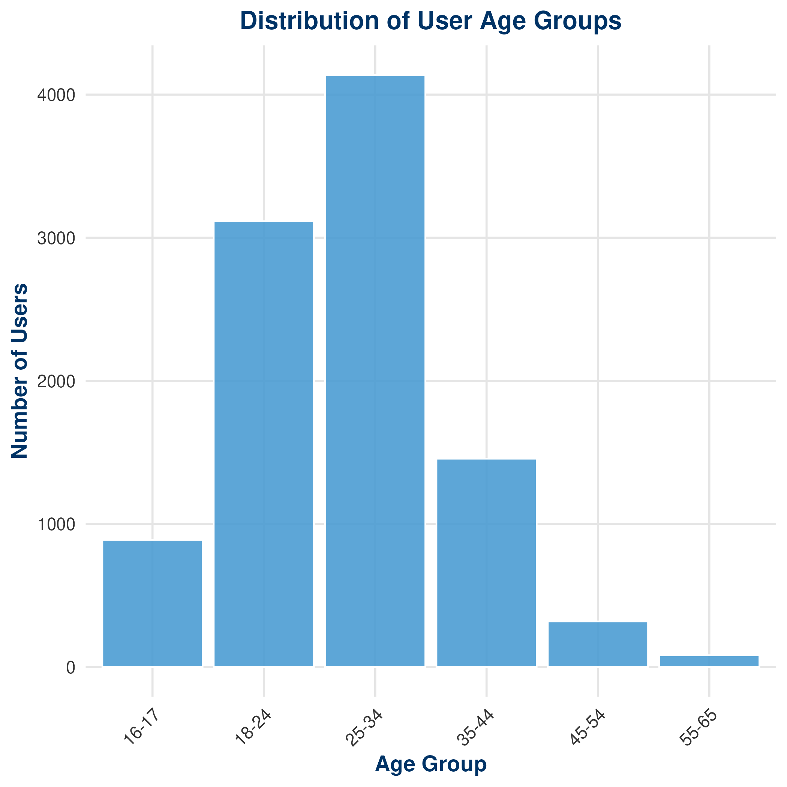
For now, just looking at the age group distribution is sufficient. The previously mention suspicion of the age groups being pretty different are in fact verified by this barchart.

# Question 1: Target Genders

Initially, I wanted to just peek at the raw counts in terms of number of interactions with ads based on gender. The full table is 200 rows (1 for each ad), but I chose to just show the first few observations.

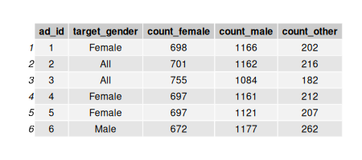

It seems like consistently, whether or not the add targeted males or females, males interacted a lot more in comparison to that of females. This might be attributed to the distribution in gender amongst the observed users-- males might just happen to be the majority within the dataset. We saw this earlier in the outlier deepdive as a possible cause. Just to examine this distribution:

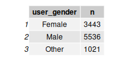
So, it does seem as though there is a pretty large difference in terms of counts of users among the three categories of gender. Thus, it may make more sense for us to look at the proportion of users interacting with these ads when looking at gender. Wait... I had almost forgotten, users can likely interact with the same ad multiple times. It might be wise to look at both unique users interacting with the add and total interactions regardless of whether users interacted with an add more than once.

Here is the plan: I will endeavor to make two plots: X axis as proportion of males, Y axis as proportion of females, legend as the target gender For each version of the above (unique users vs just proportion of interactions)


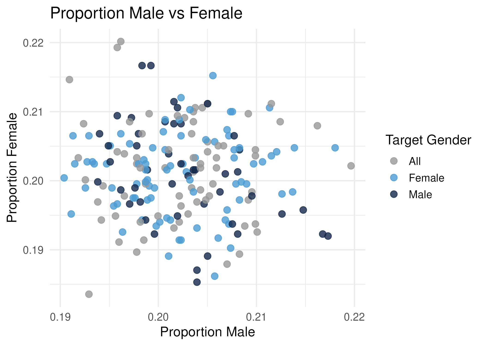
In general, I think based on individual users and their distribution in gender, no one gender is proportionally speaking overinteracting with any one add in any overwhelming amount. Given this indication, I think it really isn't all that worth it in terms of the potential for it to be interesting to look at the other figure-- where I am looking at the total sum of interactions rather than just unique users.

# Question 2: Target Interests

On a similar note to question 1 above I wanted to explore how effective ads were in drawing in people of their target interests. I took two approaches: one where I used random forest models with each distinct user's interests as the set of predictors and the other where I took an average of the interests of these distinct users and used the averages of interests as predictors for the ads' target interests. This technically could have been done with the target genders as well, but I believe the scatterplot is enough to display the presence of no significant pattern.

## Approach 1: Building Random Forest Models with Distinct User Interests as Predictors

To prep the data, I first narrowed in on the distinct users that interacted with each ad and took note of the set of interests as well as the set of interests that the ad was targeting. I split the resulting data into a train-test split of 80-20. I used the train dataset to train 13 different random forest models where each model's response was one of the potential target interests. Because there were severe class imbalances present in the response, I used a balanced sample size to train each model where the number of predictors considered at a time was 3. I then tested each of these models via the test dataset and the resulting confusion matrices are below.

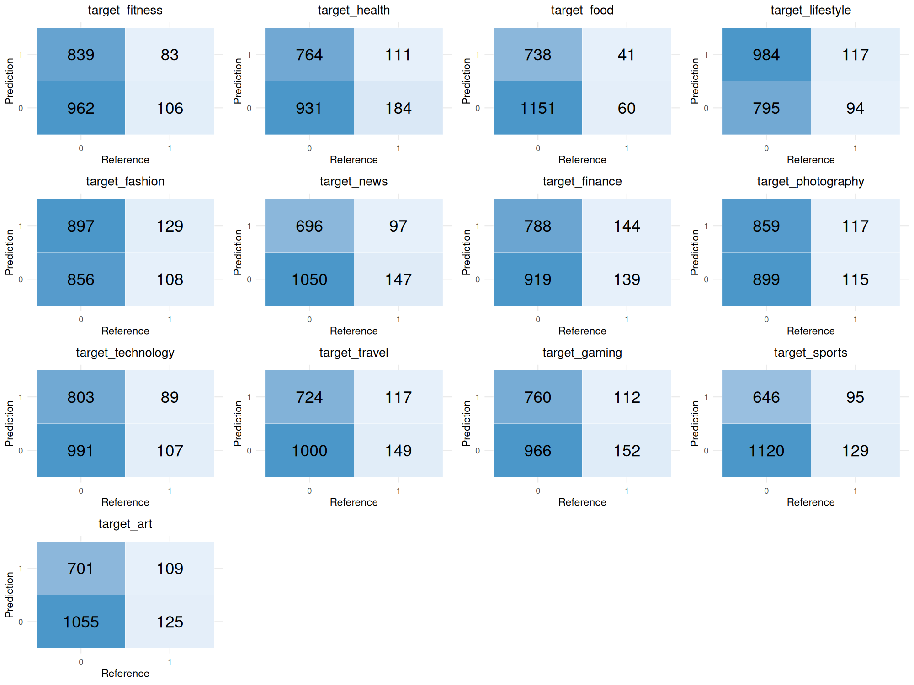

Just from looking at these matrices, it seems as though the models do not perform as ideally as we would like them to. Just to verify our conclusion, I also ended up looking at the AUC plots.

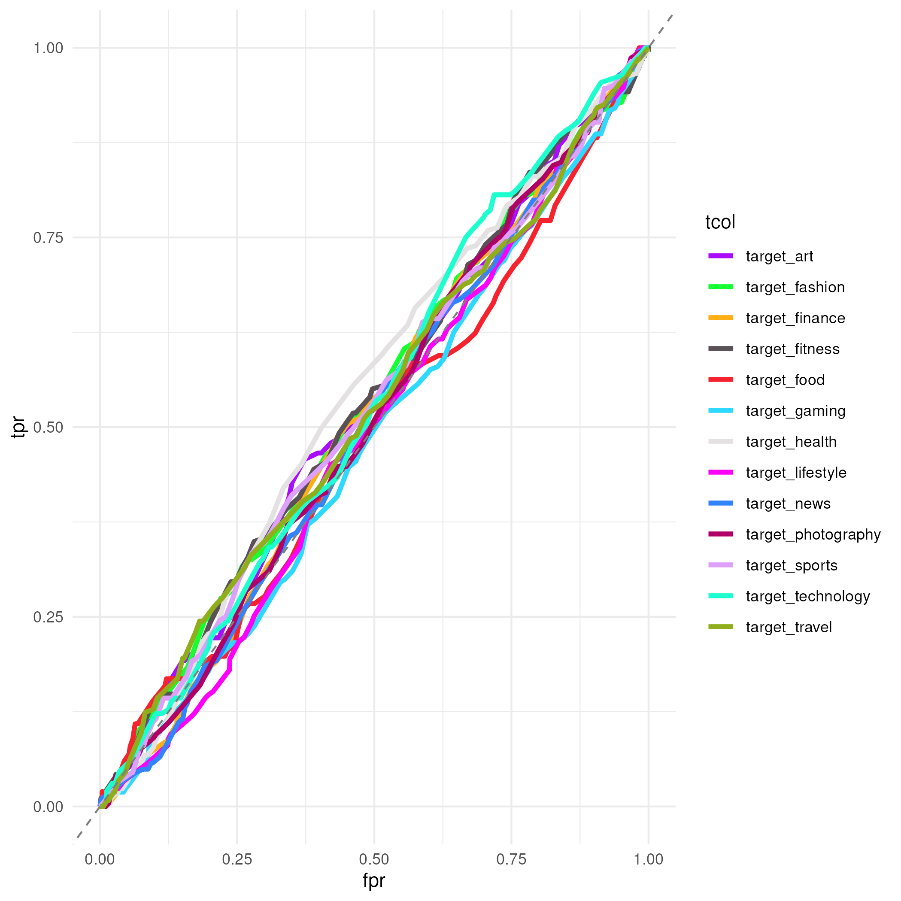
It seems as though out of all of the models, the one for target_health had the best performance. Overall, from looking at both the confusion matrices, the user interests of those who interacted with ads do not reflect that of the target interest. Just as part of a deepdive, I looked at the model for health specifically to see which user interests were good predictors for it.

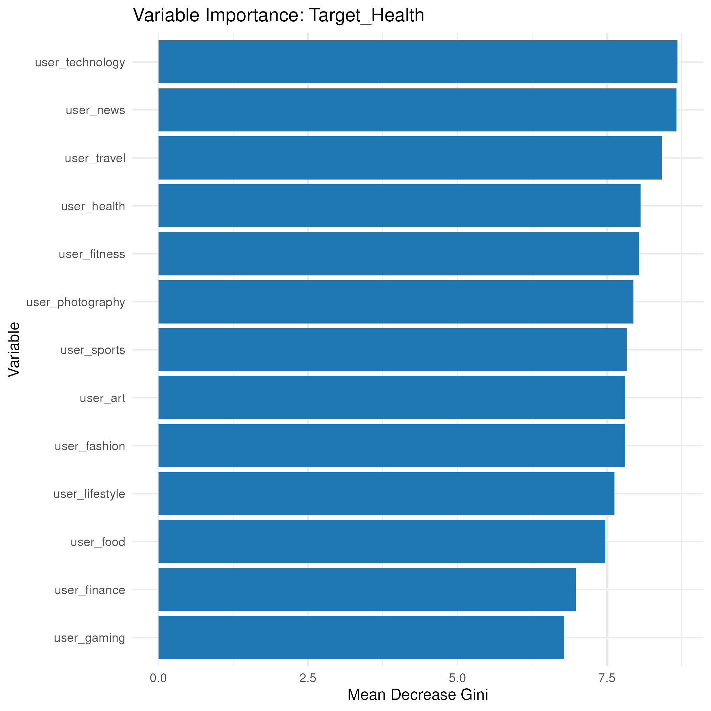

It seems as though the top user interests that predict target_health includes user_health, but not as the 'best' predictor. I will now take a different approach, where I take each observation within the train and test data to be an ad and then average the interests of the users who interacted with each ad as an attribute of the ad. Maybe that might help in seeing whether user interests are related to the target interest?

## Random Forest Models with Averages of User Interests 

In the data here, I grouped by ad_id and then took the average of the interests of users who interacted with each ad. The resulting data has 200 observations, one for each ad. I then split the data into an 80-20 train-test split, and trained random forest models for each of the 13 target interests. Below I have the resulting confusion matrices:

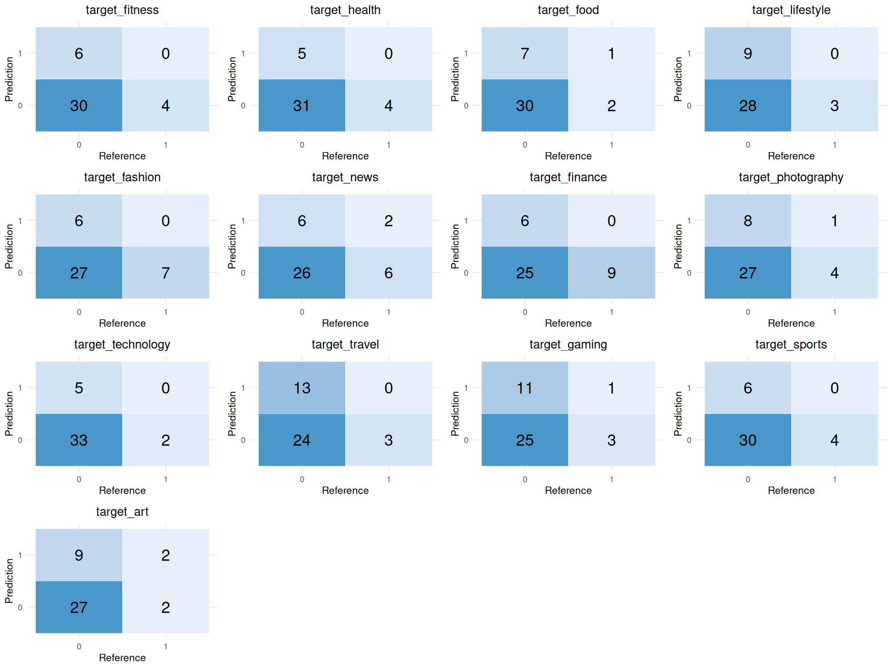

This is a smaller dataset, so numbers within the confusion matrices are not as comparable to the confusion matrices of the performances of the models that were trained on data from distinct users. Thus, I also plotted the AUC curves for these models as seen below.

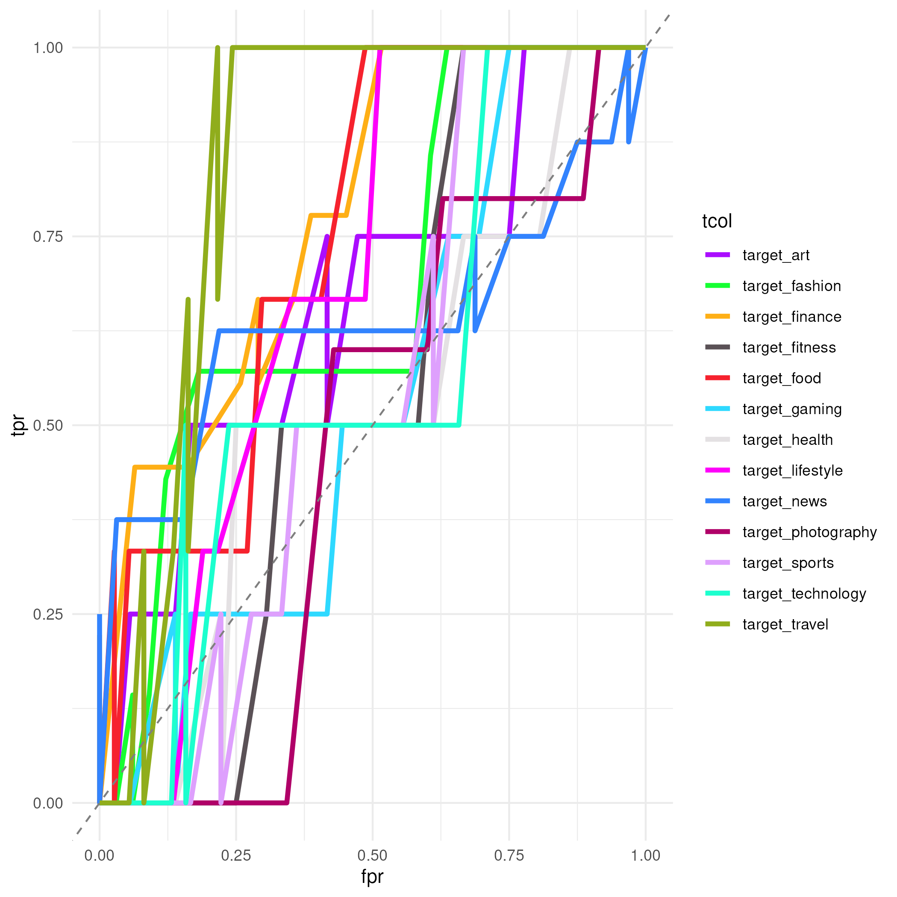


So, it seems as though some of these models did do fairly well in terms of using user interests to predict the target interests. Just out of curiosity, I produced a variable importance plot for the target_travel model.

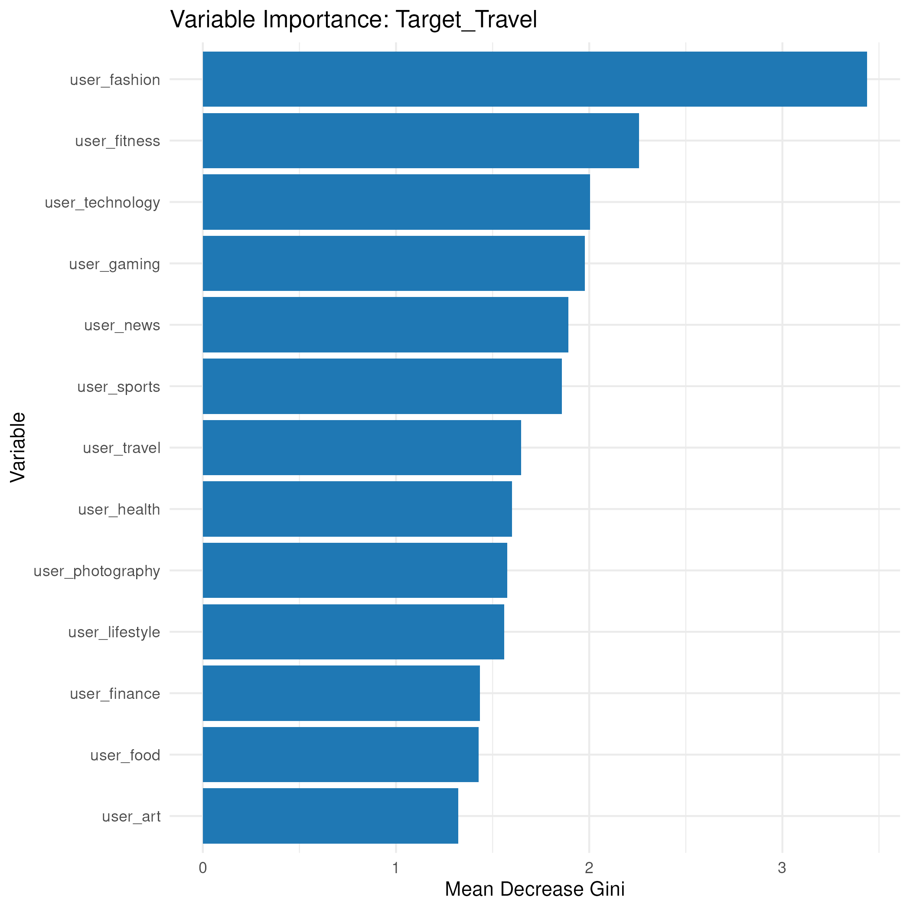

This is a very interesting result. It seems as though, from the model, ads targeting travel happened to attract users with an interest in fashion. Despite this, overall, when considering the models as a whole, user interests alone are unreliable when predicting the target interests of ads.

# Question 2: Interactions vs Campaign Budget

This second section of analysis looks into whether budget of the campaign affects the number of interactions with the ads within that campaign. I first looked at changing the data in such a way to balance out the different durations of the campaigns, thus I grouped the data by campaigns and looked at interactions per day and budget per day rather than total budget and total interactions. I then plotted the results via a scatterplot, but was still curious to see whether there was a pattern in the duration of the campaigns, so I used a scale of duration as the color for the legend of the points.

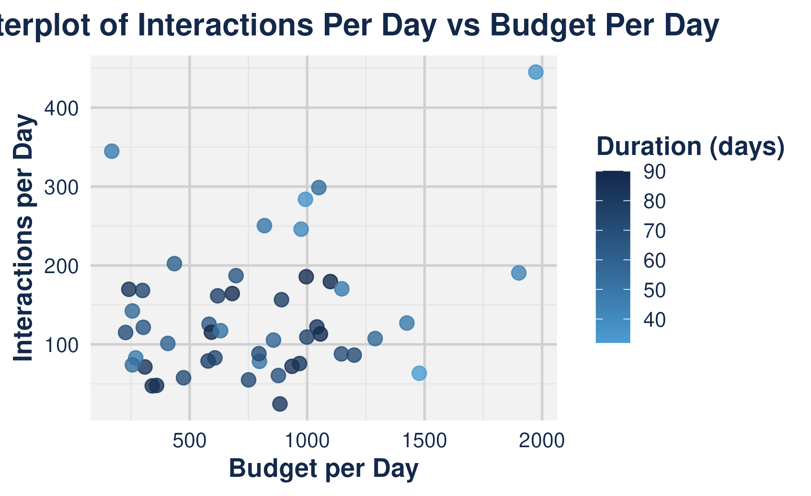

It looks like while most campaigns are within a similar interactions per day count and budget per day, there are three points that stray a bit differently. Based on the coloring of these points, all three seem to be on the shorter duration side. I ended up just out of curiosity building a basic linear model with the interactions per day as the response and budget per day as the predictor. It did not end up being significant, so I excluded results here.