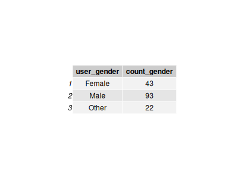
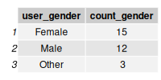

```{r setup, include=FALSE}
knitr::opts_chunk$set(echo = TRUE)
```

```{r, message=FALSE}
#libraries:

library(tidyverse)

# dataloading:

ade <- read.csv('source_data/ad_events.csv')
ads <- read.csv('derived_data/ads_cleaned.csv') %>% select(-X)
camp <- read.csv('source_data/campaigns.csv')
users <- read.csv('derived_data/user_cleaned.csv') %>% select(-X)
comp1 <- read.csv('derived_data/composite_data1.csv') %>% select(-X)
comp2 <- read.csv('derived_data/composite_data2.csv') %>% select(-X)
```

# Data Exploration (EDA):

This EDA will be a composite of a couple of sections, designed to answer specific questions. The source data is in the folder source_data and is from Kaggle. I chose this collection of datasets for three primary reasons. The first being its relation to the marketing industry and the second being it a collection of smaller datasets rather than one huge dataset. The third is cleanliness of the datasets themselves.

Looking at the composite data, it seems as though the data is very clean (no NAs and no glaring errors in data entries), which makes sense as the data description from kaggle did mention that it was very clean and easy to work with. Just looking at the datasets overall, I believe that this data likely originates from one of two sources. It is either human generated (artificial) or real data already pre-processed by an experienced data handler as the encodings for categorical variables like target_interests from the ads.csv dataset (source data) and the interests in the users.csv dataset (source data) columns match exactly in terms of categories. This is highly unlikely in the real world and thus leads to such guesses.

```{r, eval=FALSE}
# set to eval = false, but can run as needed

# No NA values:
which(is.na(comp2))

# Do target_interests align with the same as user interests?

setdiff(names(user2), names(ads2)) # Yes
```

The rest of this EDA will be split into three sections, aiming to answer the following three questions:
0.1) Are there certain users who out-interact the other users (outliers in terms of number of interactions)?
0.2) Do certain interests get more interactions online? Perhaps technology for instance?
0.3) What does the distribution of age of users look like?

## 0.1

To answer this question, I wanted to first visualize a distribution of the number of interactions per user.
```{r}
interact_count <- comp2 %>% group_by(user_id) %>% summarise(count = n()) %>%
  left_join(users, by = 'user_id')

ggplot(interact_count, aes(x = count)) +
  geom_histogram(
    bins = 30, 
    fill = "#4B9CD3",    
    color = "white",  
    alpha = 0.9
  ) +
  labs(
    title = "Distribution of User Interaction Counts",
    x = "Interaction Count",
    y = "Number of Users"
  ) +
  theme_minimal(base_size = 14) +
  theme(
    plot.title = element_text(face = "bold", size = 16, hjust = 0.5, color = "#003366"),
    axis.title = element_text(face = "bold", color = "#003366"),
    axis.text = element_text(color = "#333333"),
    panel.grid.minor = element_blank(),
    panel.grid.major = element_line(color = "gray90"),
    plot.background = element_rect(fill = "white", color = NA)
  )
ggsave("figures/interaction_count_histogram.png", width = 7, height = 5, dpi = 300)

```

The histogram shows a huge range for the x axis, which makes me question why when all the observations seem grouped to one side. Thus, I am making a boxplot of this data to see what in the world is going on.

```{r}
ggplot(interact_count, aes(y = count)) +
  geom_boxplot(
    fill = "#4B9CD3",    # Carolina blue fill
    color = "#003366",   # dark navy border
    outlier.color = "#003366",
    outlier.alpha = 0.7,
    width = 0.3
  ) +
  labs(
    title = "Distribution of User Interaction Counts",
    subtitle = "Boxplot showing spread and outliers of user interaction counts",
    y = "Interaction Count",
    x = NULL
  ) +
  theme_minimal(base_size = 14) +
  theme(
    plot.title = element_text(
      face = "bold", size = 16, hjust = 0.5, color = "#003366"
    ),
    plot.subtitle = element_text(
      hjust = 0.5, color = "#4B9CD3", size = 12
    ),
    axis.title.y = element_text(face = "bold", color = "#003366"),
    axis.text = element_text(color = "#333333"),
    panel.grid.minor = element_blank(),
    panel.grid.major.x = element_blank(),
    panel.grid.major.y = element_line(color = "gray90"),
    plot.background = element_rect(fill = "white", color = NA),
    panel.background = element_rect(fill = "white", color = NA)
  )

ggsave("figures/interaction_count_boxplot.png", width = 7, height = 5, dpi = 300)
```
It looks like there are a handful of users who are highly interactive with these ads. It may be wise to filter into these users and look at what differentiates these users. I will look at three primary variables of potential interest: gender, age, and interests.

Firstly, I've isolated out the specific datapoints that are outliers in the following code:

```{r}
# Compute quartiles and IQR
Q1 <- quantile(interact_count$count, 0.25)
Q3 <- quantile(interact_count$count, 0.75)
IQR <- Q3 - Q1

# Define lower and upper bounds
lower_bound <- Q1 - 1.5 * IQR
upper_bound <- Q3 + 1.5 * IQR

# Create a label for each observation
interact_count_outliers <- interact_count %>%
  mutate(outlier_label = 
           ifelse(count < lower_bound | 
                    count > upper_bound, "Outlier", "Normal")) %>% 
  filter(outlier_label == "Outlier")

```

Then, I will split these outliers into whether they have overinteracted or underinteracted.

```{r}
over_interact <- interact_count_outliers %>% filter(count > 36)
under_interact <- interact_count_outliers %>% filter(count < 36)
```

### Gender

Looking at gender, I mainly want to see if there is a significant difference in terms of count between the genders. I decided to use tables to show this:

```{r}
over_interact_gender <- over_interact %>% group_by(user_gender) %>% 
  summarize(count_gender = n())

under_interact_gender <- under_interact %>% group_by(user_gender) %>% 
  summarize(count_gender = n())

```
```{r}
og <- tableGrob(over_interact_gender)
png("figures/overinteract_gender.png", width = 200, height = 100)
grid.draw(og)
invisible(dev.off())
```
```{r}
ug <- tableGrob(under_interact_gender)
png("figures/underinteract_gender.png", width = 200, height = 100)
grid.draw(ug)
invisible(dev.off())
```



For those who underinteracted, it is pretty difficult to tell if there is an association of any sort because there are so few observations. For those who overinteracted, it was surprising that so many users who identified as male. I might be a bit biased, but generally, those who often are on social media the most are female... so this could indicate a platform difference.


